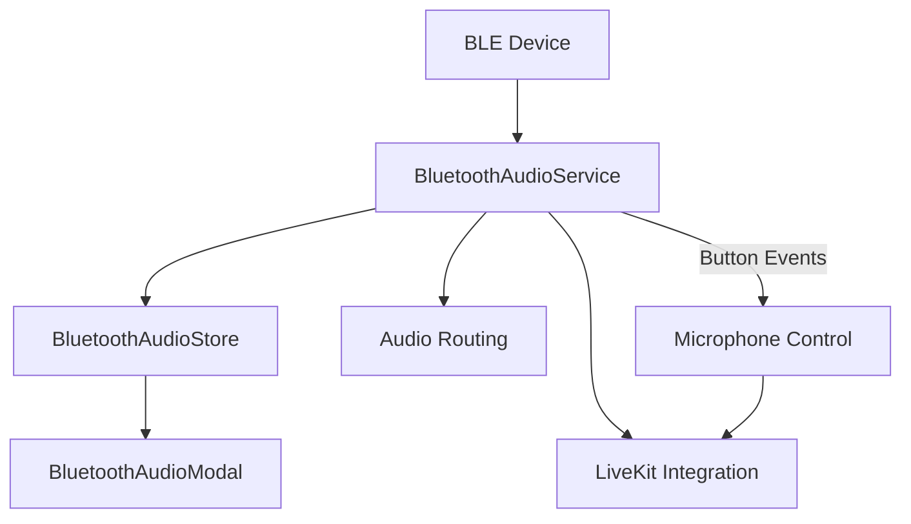

# Bluetooth Audio Integration for LiveKit

## Overview

This system provides comprehensive Bluetooth audio device integration for the LiveKit communication platform. It enables users to:

- Discover and connect to Bluetooth audio devices (speakers, headsets, earbuds)
- Route LiveKit audio through connected Bluetooth devices
- Control microphone mute/unmute via Bluetooth device buttons
- Monitor device connection status and button events

## Architecture

### Components

1. **BluetoothAudioService** (`src/services/bluetooth-audio.service.ts`)

   - Singleton service managing BLE operations
   - Handles device discovery, connection, and disconnection
   - Monitors button events and integrates with LiveKit

2. **BluetoothAudioStore** (`src/stores/app/bluetooth-audio-store.ts`)

   - Zustand store managing Bluetooth state
   - Tracks available devices, connection status, and button events
   - Provides reactive state for UI components

3. **BluetoothAudioModal** (`src/components/bluetooth/bluetooth-audio-modal.tsx`)
   - User interface for device selection and management
   - Shows device list, connection status, and controls
   - Displays button events and audio routing status

### Data Flow



## Quick Start

### 1. Import and Initialize

```typescript
import { bluetoothAudioService } from '@/services/bluetooth-audio.service';
import { useBluetoothAudioStore } from '@/stores/app/bluetooth-audio-store';
import BluetoothAudioModal from '@/components/bluetooth/bluetooth-audio-modal';
```

### 2. Show Device Selection UI

```typescript
const [isBluetoothModalOpen, setIsBluetoothModalOpen] = useState(false);

// In your component render:
<BluetoothAudioModal
  isOpen={isBluetoothModalOpen}
  onClose={() => setIsBluetoothModalOpen(false)}
/>
```

### 3. Programmatic Device Management

```typescript
// Start scanning for devices
await bluetoothAudioService.startScanning(10000); // 10 second scan

// Connect to a specific device
await bluetoothAudioService.connectToDevice('device-id');

// Check connection status
const isConnected = await bluetoothAudioService.isDeviceConnected('device-id');

// Disconnect current device
await bluetoothAudioService.disconnectDevice();
```

## API Reference

### BluetoothAudioService

#### Methods

##### `startScanning(durationMs?: number): Promise<void>`

Starts scanning for audio devices.

- `durationMs`: Scan duration in milliseconds (default: 10000)
- Throws: `Error` if Bluetooth is off or permissions denied

##### `stopScanning(): void`

Stops the current device scan.

##### `connectToDevice(deviceId: string): Promise<void>`

Connects to a specific device by ID.

- `deviceId`: BLE device identifier
- Throws: `Error` if device not found or connection fails

##### `disconnectDevice(): Promise<void>`

Disconnects the currently connected device.

##### `getConnectedDevice(): Promise<BluetoothAudioDevice | null>`

Returns the currently connected device or null.

##### `isDeviceConnected(deviceId: string): Promise<boolean>`

Checks if a specific device is connected.

##### `requestPermissions(): Promise<boolean>`

Requests necessary Bluetooth permissions (Android only).

##### `checkBluetoothState(): Promise<State>`

Returns the current Bluetooth adapter state.

### BluetoothAudioStore

#### State Properties

```typescript
interface BluetoothAudioState {
  bluetoothState: State; // Current Bluetooth state
  isScanning: boolean; // Whether scanning is active
  isConnecting: boolean; // Whether connecting to device
  availableDevices: BluetoothAudioDevice[]; // Discovered devices
  connectedDevice: BluetoothAudioDevice | null; // Connected device
  connectionError: string | null; // Last connection error
  isAudioRoutingActive: boolean; // Audio routing status
  buttonEvents: AudioButtonEvent[]; // Recent button events
  lastButtonAction: ButtonAction | null; // Last processed action
}
```

#### Actions

- `setBluetoothState(state: State)`
- `setIsScanning(isScanning: boolean)`
- `setIsConnecting(isConnecting: boolean)`
- `addDevice(device: BluetoothAudioDevice)`
- `updateDevice(deviceId: string, updates: Partial<BluetoothAudioDevice>)`
- `removeDevice(deviceId: string)`
- `clearDevices()`
- `setConnectedDevice(device: BluetoothAudioDevice | null)`
- `setConnectionError(error: string | null)`
- `clearConnectionError()`
- `setAudioRoutingActive(active: boolean)`
- `addButtonEvent(event: AudioButtonEvent)`
- `clearButtonEvents()`
- `setLastButtonAction(action: ButtonAction | null)`

### Data Types

#### BluetoothAudioDevice

```typescript
interface BluetoothAudioDevice {
  id: string; // Device identifier
  name: string | null; // Device name
  rssi?: number; // Signal strength
  isConnected: boolean; // Connection status
  hasAudioCapability: boolean; // Audio support
  supportsMicrophoneControl: boolean; // Button control support
  device: Device; // Raw BLE device
}
```

#### AudioButtonEvent

```typescript
interface AudioButtonEvent {
  type: 'press' | 'long_press' | 'double_press';
  button: 'play_pause' | 'volume_up' | 'volume_down' | 'mute' | 'unknown';
  timestamp: number;
}
```

#### ButtonAction

```typescript
interface ButtonAction {
  action: 'mute' | 'unmute' | 'volume_up' | 'volume_down';
  timestamp: number;
}
```

## Device Compatibility

### Supported Devices

The system identifies audio devices using:

1. **Service UUIDs**:

   - A2DP: `0000110A-0000-1000-8000-00805F9B34FB`
   - HFP: `0000111E-0000-1000-8000-00805F9B34FB`
   - HSP: `00001108-0000-1000-8000-00805F9B34FB`

2. **Device Name Keywords**:
   - speaker, headset, earbuds, headphone, audio, mic, sound

### Button Control Support

Button events are monitored on these characteristic UUIDs:

- `0000FE59-0000-1000-8000-00805F9B34FB` (Common button control)
- `0000180F-0000-1000-8000-00805F9B34FB` (Battery Service)
- `00001812-0000-1000-8000-00805F9B34FB` (HID Service)

**Note**: Button control implementation varies by manufacturer and may require device-specific customization.

## LiveKit Integration

### Audio Routing

When a Bluetooth device is connected:

1. Audio output is routed to the Bluetooth device
2. Microphone input uses the Bluetooth device (if supported)
3. `isAudioRoutingActive` flag is set to `true`

### Microphone Control

Button events automatically trigger LiveKit microphone control:

```typescript
// Mute/unmute based on button press
const currentMuteState = !room.localParticipant.isMicrophoneEnabled;
await room.localParticipant.setMicrophoneEnabled(currentMuteState);
```

### State Synchronization

The system monitors LiveKit's microphone state and reflects changes in the UI:

```typescript
const { currentRoom } = useLiveKitStore();
const isMuted = !currentRoom?.localParticipant?.isMicrophoneEnabled;
```

## Error Handling

### Common Errors

1. **Bluetooth Disabled**:

   - Error: "Bluetooth is PoweredOff. Please enable Bluetooth."
   - Solution: Prompt user to enable Bluetooth

2. **Permissions Denied**:

   - Error: "Bluetooth permissions not granted"
   - Solution: Request permissions via Settings

3. **Device Not Found**:

   - Error: "Device {id} not found"
   - Solution: Ensure device is discoverable and in range

4. **Connection Failed**:
   - Various BLE-specific errors
   - Solution: Retry connection, check device compatibility

### Error Recovery

```typescript
// Handle connection errors
try {
  await bluetoothAudioService.connectToDevice(deviceId);
} catch (error) {
  console.error('Connection failed:', error);
  // Show user-friendly error message
  // Optionally retry or suggest troubleshooting
}
```

## Platform-Specific Notes

### Android

- Requires `BLUETOOTH_SCAN`, `BLUETOOTH_CONNECT`, and `ACCESS_FINE_LOCATION` permissions
- Permissions are requested automatically by the service
- Some devices may require location services to be enabled

### iOS

- Bluetooth permissions handled via Info.plist
- Uses Core Bluetooth framework
- May have additional restrictions on background scanning

## Testing

### Unit Tests

Tests are provided for:

- BluetoothAudioStore state management
- BluetoothAudioService methods
- BluetoothAudioModal UI components

### Mocking

The system includes mocks for:

- `react-native-ble-plx` library
- Device discovery and connection simulation
- Button event simulation

### Running Tests

```bash
# Run all Bluetooth audio tests
yarn test src/stores/app/__tests__/bluetooth-audio-store.test.ts
yarn test src/services/__tests__/bluetooth-audio.service.test.ts
yarn test src/components/bluetooth/__tests__/bluetooth-audio-modal.test.tsx
```

## Performance Considerations

### Scanning Optimization

- Limit scan duration to conserve battery
- Use specific service UUIDs to filter results
- Stop scanning when device is found

### Memory Management

- Button events are limited to 50 recent entries
- Subscriptions are properly cleaned up on disconnection
- Service instance is destroyed when no longer needed

### Battery Impact

- Minimize background scanning
- Disconnect when not in use
- Monitor connection state to avoid unnecessary operations

## Troubleshooting

### Device Not Appearing

1. Ensure device is in pairing/discoverable mode
2. Check device compatibility (supported services)
3. Verify Bluetooth permissions
4. Try restarting Bluetooth adapter

### Connection Drops

1. Check signal strength (RSSI)
2. Ensure device stays within range
3. Monitor for interference
4. Implement automatic reconnection logic

### Button Events Not Working

1. Verify device supports button control
2. Check characteristic UUIDs for your specific device
3. Monitor BLE logs for button data
4. Implement device-specific parsing logic

### Audio Routing Issues

1. Verify device supports audio profiles (A2DP/HFP)
2. Check platform-specific audio routing
3. Ensure LiveKit audio context is properly configured
4. Test with known compatible devices

## Future Enhancements

### Planned Features

1. **Auto-reconnection**: Automatically reconnect to known devices
2. **Device Preferences**: Remember user's preferred devices
3. **Advanced Button Mapping**: Customizable button actions
4. **Multi-device Support**: Connect multiple devices simultaneously
5. **Audio Quality Settings**: Configurable codec preferences

### Contributing

When adding new features:

1. Update the service interface
2. Add corresponding store actions
3. Update UI components
4. Write comprehensive tests
5. Update this documentation

## License

This Bluetooth audio integration system is part of the larger application and follows the same licensing terms.
